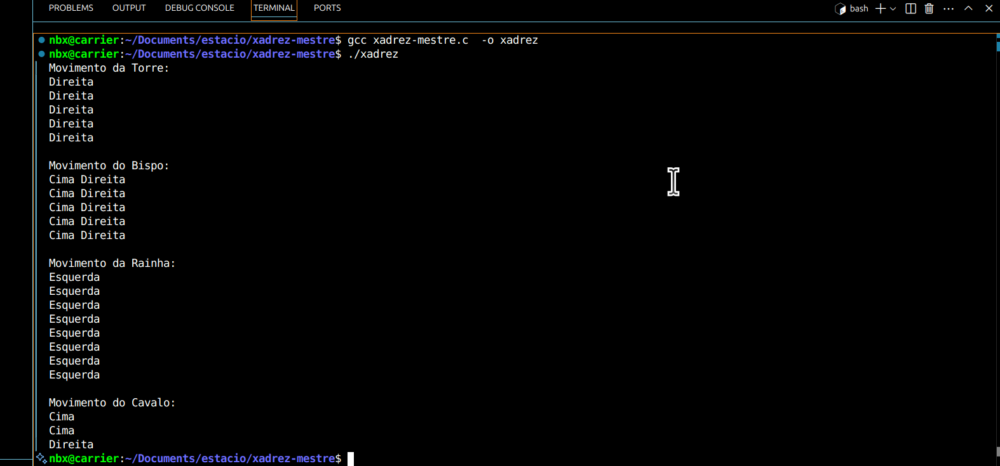

   

[](https://www.gnu.org/licenses/gpl-3.0)

# Simulação de Movimentação de Peças de Xadrez em C ♟️

Este projeto foi desenvolvido como parte do desafio da disciplina de Programação em C, com foco no uso de estruturas de repetição para simular movimentos de peças do jogo de xadrez.

## Universidade Estácio de Sá

Projeto desenvolvido para a disciplina Introdução à Programação de Computadores.  
Curso Engenharia de Software.

## 🎯 Objetivo

Simular os movimentos das peças **Torre**, **Bispo**, **Rainha** e **Cavalo**, utilizando **funções recursivas**, **loops aninhados** e **condições compostas**, conforme os requisitos do nível **Mestre**.

## 📦 Arquivo

- `xadrez.c`: contém toda a lógica de movimentação das peças, incluindo comentários explicativos.

## 🧠 Peças e Lógica Utilizada

| Peça    | Movimento Simulado                               | Técnica aplicada                          |
|---------|--------------------------------------------------|--------------------------------------------|
| Torre   | 5 casas para a direita                           | Função recursiva                           |
| Bispo   | 5 casas na diagonal (cima/direita)               | Recursividade + loops aninhados            |
| Rainha  | 8 casas para a esquerda                          | Função recursiva                           |
| Cavalo  | 2 casas para cima e 1 para a direita (em "L")    | Loops aninhados com múltiplas condições    |

### 🧩 Detalhes do Cavalo

- Movimento simulado com:
  - `for` controlando a subida (2x "Cima")
  - `for` interno com condição e `break` para mover 1x "Direita"
- O uso de `continue` e `break` foi aplicado para controle do fluxo.

## 🚀 Como executar

1. Clone o repositório:
   ```bash
   git clone https://github.com/92username/xadrez-mestre.git
   cd xadrez-mestre
   ```

2. Compile o código:
   ```bash
   gcc xadrez-mestre.c -o xadrez
   ```

3. Execute:
   ```bash
   ./xadrez
   ```

## Output esperado:



## 📚 Aprendizado

Este projeto visa exercitar o uso de **recursividade** e **estrutura de repetição aninhada** em C, reforçando o pensamento lógico e a organização de código modularizado.

## 📎 Licença

Projeto acadêmico. Uso livre para fins educacionais.
